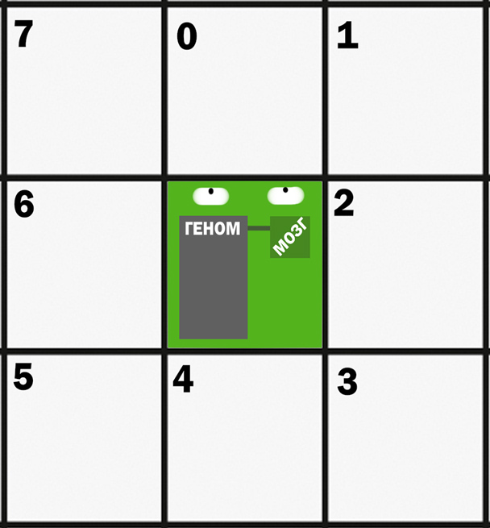

# ALSS v2.0.0

**ALSS** (Artificial Life Simulation System) - **Система симуляции искусственой 
жизни**, это практическая часть выпускной бакалаврской работы ПГУТИ студента 
группы ИСТ-25у Додонова Н.А. Проект разрабатывается с декабря прошлого года по
нынешний момент.

> **Warning** 
Проект ещё в состоянии доработки, тут могут быть баги и огрехи. 
Запускайте всё на свой страх и риск!

## Что это такое?

**ALSS** - это модель симуляции так называемой **"Сильной"** Искусственой 
Жизни (далее ИЖ), т.е. моделирование жизни такой, какая она могла бы быть.
Проект объединяет идеи клеточных автоматов, генетических алгоритмов и 
самопрограммируемых программ.

**Модель ALSS** - это некоторый 2-х мерный мир состоящий клеток. У каждой клетки
есть своя высота, совокупность которой определяет неизменный ландшафт модели.
Имеются глобальные переменные совещённости и уровня моря.

**Агент модели AlSS** - это объект на стыке самопищущейся программы, искусственного
организма и робота с самооучающимся ИИ без нейронных сетей. Состоит агент из трёх
основных частей:
* Тело - программное представление/отражение агента в мире модели. Здесь распологаются
органы чувств, хранится энергия и статистика;
* Геном - массив байт, хранящих в себе наборы инструкций к выполнению, а так же указатель 
на определённый байт. По своей сути это программа и программный указатель.
* Мозг - интерпритатор генома. Программая функция, считывающая по указателю байт,
после чего сравнивая его с имеющимися данными о наборе команд и выдающая команду телу
к какому либо действию.

## F.A.Q.

Будет добавлен позже

